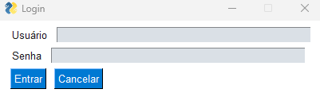
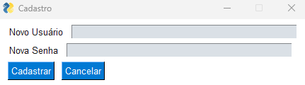
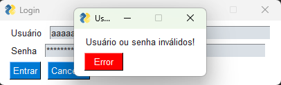
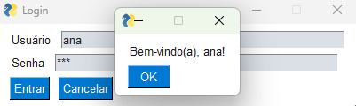

Tela de Login em Python

Projeto simples feito em Python para treinar programação com interface gráfica usando [FreeSimpleGUI](https://pypi.org/project/FreeSimpleGUI/).

✨ Funcionalidades
- Cadastro de usuários com senha
- Login de usuários existentes
- Senhas salvas de forma criptografada (hash SHA-256)
- Persistência dos dados em arquivo JSON
- Testes automatizados com unittest

📂 Imagens do projeto

## Tela de Login  
  

---

## Tela de Cadastro  
  

---

## Mensagem de Erro  
  

---

## Mensagem de Sucesso  
  
